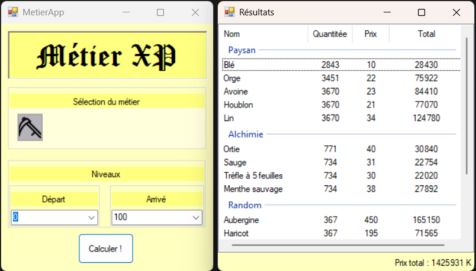

# AppliMetier
Permet de calculer le prix moyen pour passer des niveaux des différents métiers

Entrez ici les instructions pour bien débuter avec votre projet...

## Utilisation

Dans Visual studio (il faut avoir le package WinForm), build la solution et lancer la solution.

Il faut au préalable remplir le prix moyen des ressources dans la classe "Data/InitializeDatas.cs".

Screen de l'application : 
